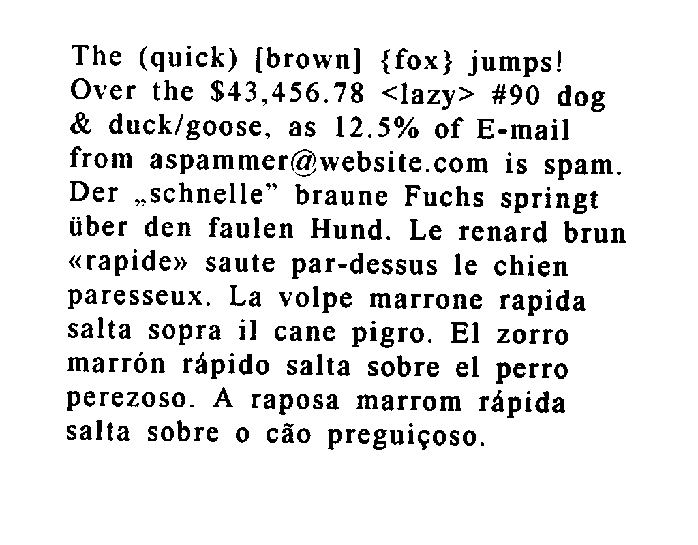
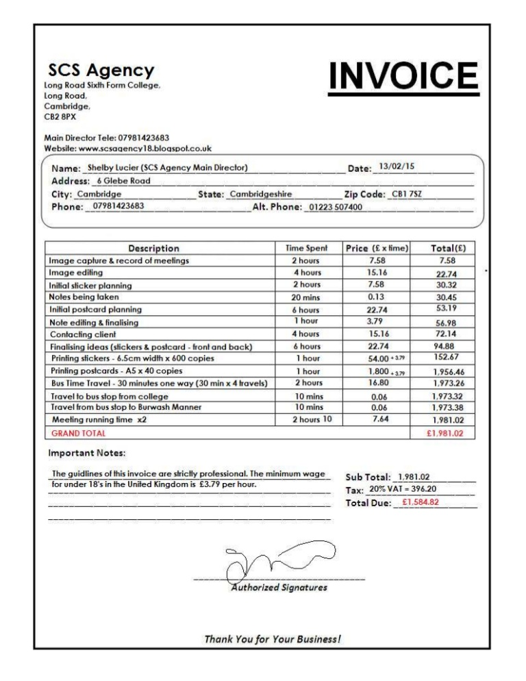

# OCR Plugin

[](.coverage/html/index.html)
[](.coverage/html/index.html)
[](.coverage/html/index.html)

---

## Description
This is a simple OCR microservice written in Python using the [FastAPI](https://github.com/tiangolo/fastapi) framework and the [PyTesseract](https://github.com/madmaze/pytesseract) library, which is a wrapper for Google's [Tesseract OCR Engine](https://github.com/tesseract-ocr/tesseract). It provides a single endpoint, `/extract-text`, which allows users to extract text from images. To extract text from an image, make a POST request to the `/extract-text` endpoint with the image file attached. The microservice will return a JSON object containing the extracted text.

Request

      curl -X 'POST' \
        'http://0.0.0.0:3000/extract-text' \
        -H 'accept: application/json' \
        -H 'Content-Type: multipart/form-data' \
        -F 'file=@hello-world.jpg;type=image/jpeg'

Response

      { message: "Hello World" }

### Limitations
Currently, this microservice only supports image files with the following MIME types:
- image/jpeg
- image/png

### Examples

#### Multilingual sample

[]()

      {
        "message": "The (quick) [brown] {fox} jumps!\nOver the $43,456.78 <lazy> #90 dog\n& duck/goose, as 12.5% of E-mail\nfrom aspammer@website.com is spam.\nDer ,.schnelle” braune Fuchs springt\niiber den faulen Hund. Le renard brun\n«rapide» saute par-dessus le chien\nparesseux. La volpe marrone rapida\nsalta sopra il cane pigro. El zorro\nmarron rapido salta sobre el perro\nperezoso. A raposa marrom rapida\nsalta sobre o céo preguicoso.\n\f"
      }

      
#### Prescription


      {
        "message": "Adobe Stock | #5667167\n\nEAH GB OSESS616 Luce 978269\n\nMEDICAL CENTRE\n\n241 St\nNew York, SY9I73, USA\n\name_Joba Smith,\naopness 162 Example St MY vate 0\n\nBy\n\nBeteloe 100mg - 1 tab BID\nDortlamidvm 10 mg =! tab BID\nCimetidine 50 mg - 2 tabs TID\nOnprelel SOng «1 4b QD\n\n \n\n \n\n \n\n \n\nDe. Steve Jeharon\na\n\nLape\nREFILL 0702 3.4 5 PRN\n\n \n\f"
      } 

#### Invoice



      {
        "message": "SSS,Agency INVOICE\n\nCambridge,\ncB2 8x\n\nMain Director Tele: 07981423683\nWebsite: www.scsaaency18.bloaspol.co.uk\n\n \n\nName: _Shelby Lucier (SCS Agency Main Director) Date:_13/02/15\nAddress: _6 Glebe Road\n\nCity: Cambridge _ State: Cambridgeshire Zip Code: _CB1 78z\nPhone: _ 07981423683 _Alt. Phone: _01223 507400\n\n \n\n \n\nDescription Price (£ xtime)| Total(£)\nImage capture & record of meetings 758 7.58\nimage ediling 15.16 22.74\nInitial sticker planning 758 30.32,\nNoles being taken 013 30.45\nInitial postcard planning | 22.74 S39\nNote ediling & finalising 379 56.98\nContacting client 15.16 72.14\nFinalising ideas (stickers & postcard - front and back) 22.74 94.88\nPrinting stickers - 6.5cm width x 600 copies 54.00 +377 152.67\"\nPrinting postcards -AS x 40 copies 1800-2 | 1,956.46\nBus Time Travel - 30 minutes one way (30 min x 4 travels) 16.80 4,973.26\n\nTravel io bus stop from college 0.06 1.97332\nTravel from bus stop to Burwash Manner 0.08 1,973.38\n\n‘Meeting running time x2 764 1,981.02\n(GRAND TOTAL £1,981,02\n\n \n\n \n\n \n\n \n\n \n\n \n\n \n\n \n\n \n\n \n\n \n\n \n\n \n\n \n\n \n\n \n\n \n\n \n\n \n\n \n\n \n\nImportant Notes:\n\nThe guidlines of this invoice are sicily professional. The minimum wage_ sub Total: _1.981.02\n\nTor under 18's inthe Uniled Kingdom is £3.79 per hour. Tax: 20%VAT=396.20\n\nTotal Due: _ £1.584.82\n\nfuthorized Signatures\n\nThank You for Your Business!\n\n \n\f"
      }

---

## Local development

To develop the service locally you need:

- python 3.10

A virtual environment is a Python tool for dependency management and project
isolation. For further info about the creation and management of a virtual environment,
please check the [Python official documentation](https://docs.python.org/3/library/venv.html).
To activate your virtual envirorment run the following command on
your terminal:

```shell
source /path/to/virtual/environment/bin/activate
```

When finished, to deactive the virtual envirorment run the following
command:

```shell
deactivate
```

During development, you will probably have to perform the same operations many
times: start the application locally, check the code quality, run tests and compute coverage. Therefore,
to avoid to remember each time the syntax of the commands to be executed, the
main commands were collected in a Makefile. [Makefile](https://www.gnu.org/software/make/manual/make.html) is a Unix automation tool
that contains the recipe to build and run your program. So, listed below are the
commands that can be executed by the make command:

Install requirements and pre-commit:
```shell
make setup
```

Run application locally:
```shell
make start
```

Run linter:
```shell
make lint
```

Run tests:
```shell
make test
```

Compute the coverage:
```shell
make coverage
```