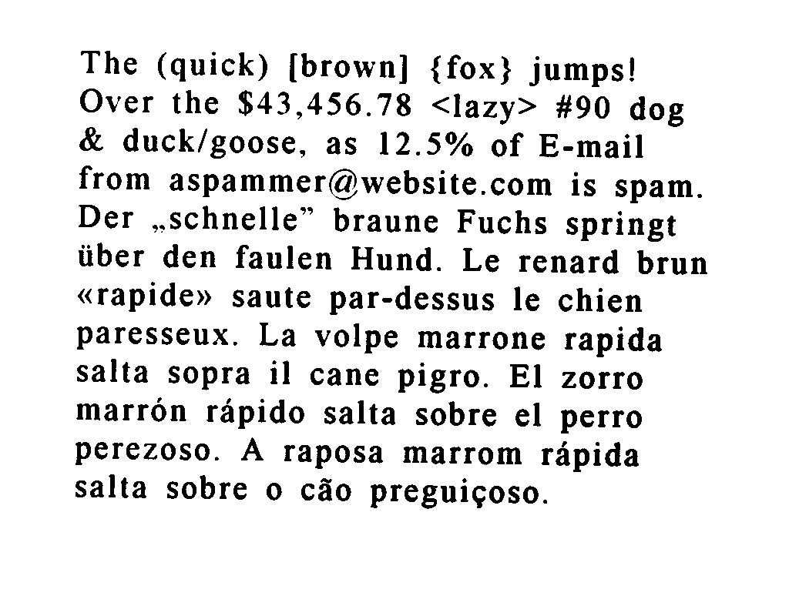
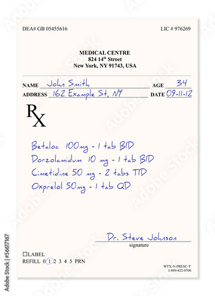
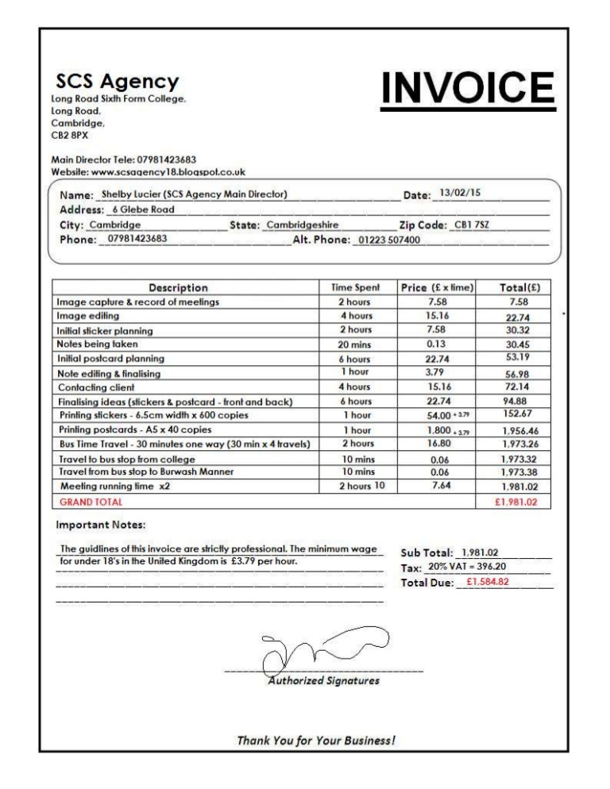

# OCR Overview
This is a simple OCR microservice written in Python using the [FastAPI](https://github.com/tiangolo/fastapi) framework and the [PyTesseract](https://github.com/madmaze/pytesseract) library, which is a wrapper for Google's [Tesseract OCR Engine](https://github.com/tesseract-ocr/tesseract). It's a standalone plugin that doesn't require configuration.

## Limitations
Currently, this microservice only supports image files with the following MIME types:
- image/jpeg
- image/png

## Examples

### Multilingual sample

      {
        "message": "The (quick) [brown] {fox} jumps!\nOver the $43,456.78 <lazy> #90 dog\n& duck/goose, as 12.5% of E-mail\nfrom aspammer@website.com is spam.\nDer ,.schnelle” braune Fuchs springt\niiber den faulen Hund. Le renard brun\n«rapide» saute par-dessus le chien\nparesseux. La volpe marrone rapida\nsalta sopra il cane pigro. El zorro\nmarron rapido salta sobre el perro\nperezoso. A raposa marrom rapida\nsalta sobre o céo preguicoso.\n\f"
      }

      
### Prescription

      {
        "message": "Adobe Stock | #5667167\n\nEAH GB OSESS616 Luce 978269\n\nMEDICAL CENTRE\n\n241 St\nNew York, SY9I73, USA\n\name_Joba Smith,\naopness 162 Example St MY vate 0\n\nBy\n\nBeteloe 100mg - 1 tab BID\nDortlamidvm 10 mg =! tab BID\nCimetidine 50 mg - 2 tabs TID\nOnprelel SOng «1 4b QD\n\n \n\n \n\n \n\n \n\nDe. Steve Jeharon\na\n\nLape\nREFILL 0702 3.4 5 PRN\n\n \n\f"
      } 

### Invoice

      {
        "message": "SSS,Agency INVOICE\n\nCambridge,\ncB2 8x\n\nMain Director Tele: 07981423683\nWebsite: www.scsaaency18.bloaspol.co.uk\n\n \n\nName: _Shelby Lucier (SCS Agency Main Director) Date:_13/02/15\nAddress: _6 Glebe Road\n\nCity: Cambridge _ State: Cambridgeshire Zip Code: _CB1 78z\nPhone: _ 07981423683 _Alt. Phone: _01223 507400\n\n \n\n \n\nDescription Price (£ xtime)| Total(£)\nImage capture & record of meetings 758 7.58\nimage ediling 15.16 22.74\nInitial sticker planning 758 30.32,\nNoles being taken 013 30.45\nInitial postcard planning | 22.74 S39\nNote ediling & finalising 379 56.98\nContacting client 15.16 72.14\nFinalising ideas (stickers & postcard - front and back) 22.74 94.88\nPrinting stickers - 6.5cm width x 600 copies 54.00 +377 152.67\"\nPrinting postcards -AS x 40 copies 1800-2 | 1,956.46\nBus Time Travel - 30 minutes one way (30 min x 4 travels) 16.80 4,973.26\n\nTravel io bus stop from college 0.06 1.97332\nTravel from bus stop to Burwash Manner 0.08 1,973.38\n\n‘Meeting running time x2 764 1,981.02\n(GRAND TOTAL £1,981,02\n\n \n\n \n\n \n\n \n\n \n\n \n\n \n\n \n\n \n\n \n\n \n\n \n\n \n\n \n\n \n\n \n\n \n\n \n\n \n\n \n\n \n\nImportant Notes:\n\nThe guidlines of this invoice are sicily professional. The minimum wage_ sub Total: _1.981.02\n\nTor under 18's inthe Uniled Kingdom is £3.79 per hour. Tax: 20%VAT=396.20\n\nTotal Due: _ £1.584.82\n\nfuthorized Signatures\n\nThank You for Your Business!\n\n \n\f"
      }